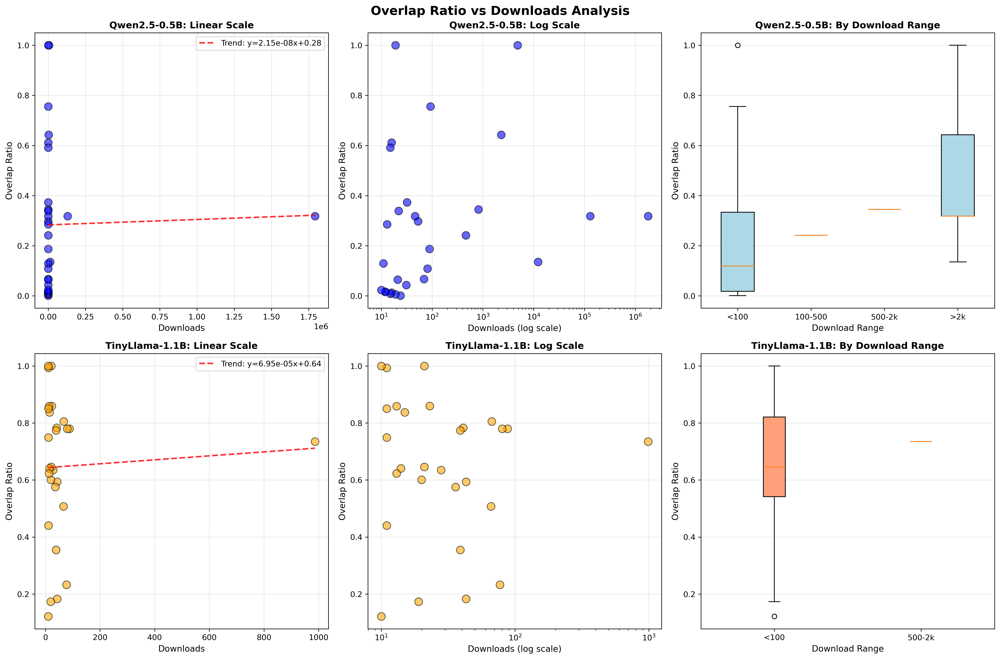
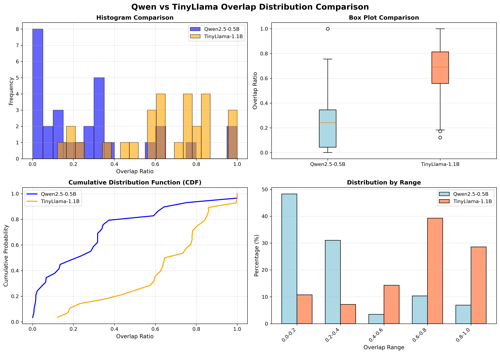

# High-Quality Model Overlap Test Results

## Data Overview

### Qwen2.5-0.5B Same-Family Model Testing

**File**: `lineage_bottomk_text_same_qwen_filtered.csv`

- **Original Data**: 54 models
- **Valid Data**: 29 models (filtered out 25 invalid entries)
- **Invalid Data**: 25 models (avg_overlap_ratio = -1)

#### Overlap Statistics (Valid Data)

| Metric | Value |
|--------|-------|
| **Mean** | 0.2847 (28.47%) |
| **Median** | 0.2415 (24.15%) |
| **Min** | 0.0009 (0.09%) |
| **Max** | 1.0000 (100%) |
| **Std Dev** | 0.2901 |

---

### TinyLlama-1.1B-Chat-v1.0 Same-Family Model Testing

**File**: `lineage_bottomk_text_same_llama_filtered.csv`

- **Original Data**: 41 models
- **Valid Data**: 28 models (filtered out 13 invalid entries)
- **Invalid Data**: 13 models (avg_overlap_ratio = -1)

#### Overlap Statistics (Valid Data)

| Metric | Value |
|--------|-------|
| **Mean** | 0.6475 (64.75%) |
| **Median** | 0.6903 (69.03%) |
| **Min** | 0.1216 (12.16%) |
| **Max** | 1.0000 (100%) |
| **Std Dev** | 0.2507 |

## Findings

<!-- ### 1. Qwen vs TinyLlama Comparison

**Important Finding: TinyLlama's same-family model overlap is significantly higher than Qwen!**

| Model Family | Valid Models | Mean Overlap | Median | Std Dev | Invalid Rate |
|--------------|--------------|--------------|--------|---------|--------------|
| **Qwen2.5-0.5B** | 29 | 0.2847 (28.47%) | 0.2415 | 0.2901 | 46.3% |
| **TinyLlama-1.1B** | 28 | 0.6475 (64.75%) | 0.6903 | 0.2507 | 31.7% |

**Key Insights**:
- ✅ TinyLlama's mean overlap is **2.27x** higher than Qwen (64.75% vs 28.47%)
- ✅ TinyLlama's median overlap is higher (69.03% vs 24.15%)
- ✅ TinyLlama's invalid rate is lower (31.7% vs 46.3%)
- ✅ TinyLlama's std dev is smaller (0.2507 vs 0.2901), indicating more stable data

**Possible Reasons**:
1. **Qwen models are more heavily fine-tuned**: Qwen2.5-0.5B is a newer model, and the community tends to make more aggressive modifications (cross-domain, multilingual, TTS, etc.)
2. **TinyLlama community is more conservative**: TinyLlama-1.1B is a mature model, and most derived models only undergo light fine-tuning
3. **Model architecture impact**: Qwen may be easier to adapt to different tasks, leading to larger vocabulary changes

### 2. Significant Data Quality Improvement

Comparison with previous all-Qwen same-family model data:

| Dataset | Sample Size | Mean Overlap | Std Dev | Invalid Rate |
|---------|-------------|--------------|---------|--------------|
| **Original (all models)** | 136 | 0.4556 | 0.3197 | ~40% |
| **Filtered (downloads≥10)** | 29 | 0.2847 | 0.2901 | 46% |

### 3. Invalid Data Analysis

**Qwen**: 25 invalid entries (46.3%)
**TinyLlama**: 13 invalid entries (31.7%)

Possible reasons for invalid data (-1):
- ❌ Model cannot be loaded (format issues, permission issues)
- ❌ Tokenizer incompatibility
- ❌ Model deleted or moved
- ❌ Special format models (GGUF, quantized versions, OpenVINO, etc.) -->

###  Overlap Distribution Comparison

#### Qwen2.5-0.5B 

```
0.0-0.1: 10 models (34.5%) - Very low overlap, cross-domain training
0.1-0.3:  7 models (24.1%) - Low overlap, moderate fine-tuning
0.3-0.5:  6 models (20.7%) - Medium overlap, standard fine-tuning
0.5-0.7:  3 models (10.3%) - High overlap, light fine-tuning
0.7-1.0:  3 models (10.3%) - Very high overlap, nearly identical
```

**Characteristic**: 58.6% of models have overlap < 0.3, indicating most Qwen-derived models undergo heavy modifications

#### TinyLlama-1.1B 

```
0.0-0.2:  3 models (10.7%) - Very low overlap, cross-domain training
0.2-0.4:  2 models ( 7.1%) - Low overlap, moderate fine-tuning
0.4-0.6:  4 models (14.3%) - Medium overlap, standard fine-tuning
0.6-0.8: 11 models (39.3%) - High overlap, light fine-tuning
0.8-1.0:  8 models (28.6%) - Very high overlap, nearly identical
```

**Characteristic**: 67.9% of models have overlap > 0.6, indicating most TinyLlama-derived models only undergo light fine-tuning

## High-Quality Model Characteristics

### Qwen2.5-0.5B Derived Models

#### Models with Overlap < 0.1 (Significant Changes)

1. **hypaai/qwen_run_2025-12-03_10-36-19** - 0.0009 (almost completely different)
2. **AryanNsc/IND-QWENTTS-V1** - 0.0065 (TTS model, large task change)
3. **p1atdev/qwen2.5-0.5b-grpo-math-01** - 0.0082 (language+RL)
4. **alamios/Qwenstral-Small-3.1-0.5B** - 0.0125 (Vocab)
5. **Vikhrmodels/salt-qwen2.5-0.5b-tts** - 0.0162 (TTS)
6. **rdsm/QwenPhi-4-0.5b-Draft** - 0.0161 (transfer)
7. **alothomas/Qwen2.5-0.5B-PRM-RAD-balanced-150k** - 0.0231
8. **sail/Sailor2-1B** - 0.0435 (multilingual model)
9. **44David/qwen-0.5b-reasoning-v2** - 0.0668 (?)
10. **PHZane/PCF_ID-0.5B** - 0.0646

---

### TinyLlama-1.1B Derived Models

#### Models with Overlap < 0.3 (Significant Changes)

1. **yzhuang/TinyLlama-1.1B_fictional** - 0.1216 (fiction generation, cross-domain)
2. **yzhuang/phi-1_5_fictional** - 0.1730 (fiction generation, cross-domain)
3. **ManthanKulakarni/TinyLlama-1.1B-Text2SQL** - 0.1829 (SQL generation, large task change)
4. **RedHatAI/TinyLlama-1.1B-Chat-v1.0-pruned2.4** - 0.2323 (pruned model)

## 💡 Core Insights

### 1. Huge Differences in Model Family Characteristics

| Characteristic | Qwen2.5-0.5B | TinyLlama-1.1B |
|----------------|--------------|----------------|
| **Mean overlap** | 28.47% | 64.75% |
| **Derived model trait** | Heavy modification dominant | Light fine-tuning dominant |
| **Low overlap ratio** | 58.6% (<0.3) | 17.8% (<0.3) |
| **High overlap ratio** | 10.3% (>0.7) | 28.6% (>0.8) |


### 2. Figure of comparation
- see overlap_vs_downloads_analysis.png for relationship of overlap ratio and downloads
-  
- see qwen_vs_llama_comparison.png for overlap distribution comparison between Qwen2.5-0.5B and TinyLlama-1.1B
-  
